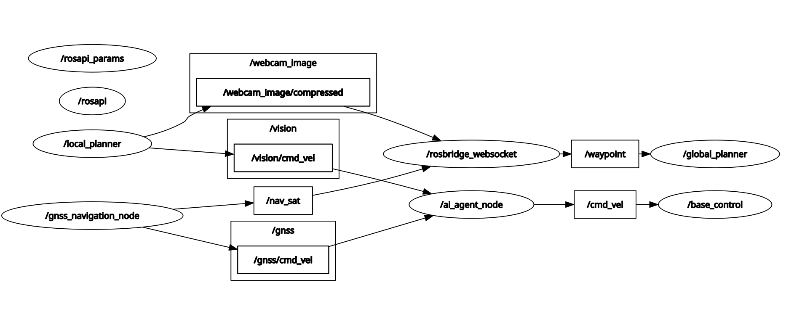

## Install RosBridge:
1. Install RosBridge server by running the following command:
    ```shell
    sudo apt install ros-<ROS_DISTRO>-rosbridge-server
    ```
2. Source your ROS distribution setup:
    ```shell
    source /opt/ros/<ROS_DISTRO>/setup.bash
    ```
3. Install script dependencies
    ```shell
    sudo apt install expect -y
    ```

## Launch RosBridge:
1. Launch the RosBridge server with the following command:
    ```shell
    ros2 launch rosbridge_server rosbridge_websocket_launch.xml 
    ```
   This will start the server on port 9090.


## Setup Raspberry Pi
1. Connecting Raspberry Pi to L298N:
    - IN1/IN2 (left motor) should connect to GPIO 11 and GPIO 12.
    - IN3/IN4 (right motor) should connect to GPIO 13 and GPIO 17.


# Motor A (Left Motor)
LEFT_MOTOR_FORWARD_PIN = 11 # yellow
LEFT_MOTOR_BACKWARD_PIN = 12 # blue

# Motor B (Right Motor)
RIGHT_MOTOR_FORWARD_PIN = 13 # purple
RIGHT_MOTOR_BACKWARD_PIN = 17 # orange

```bash
sudo apt install python3-rpi.gpio
```

## About system
